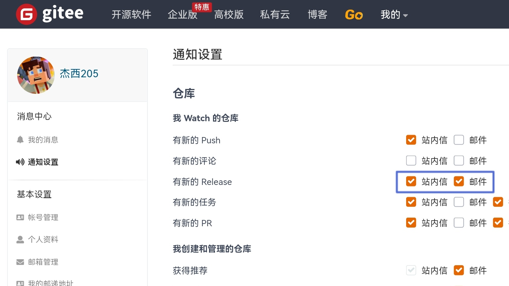
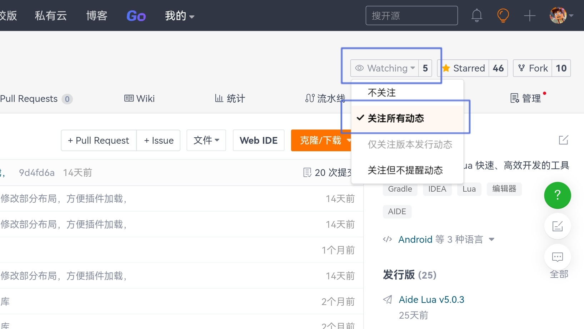

# Aide Lua

## 注意 Alert
如需使用源代码，请进入 [发行版](https://gitee.com/Jesse205/AideLua/releases) 页面下载 
If you need to use the source code, please go to the [releases](https://gitee.com/Jesse205/AideLua/releases) page to download.

## 简介
Aide Lua 是一款依赖 Aide 的 Lua 编辑器 
Aide Lua 可以让您在移动设备上也能享受高级的、快速的软件开发

## 下载
[〖Aide 高级设置版〗](https://www.lanzouy.com/b00zdhbeb)

1. [Gitee 下载 (推荐)](https://gitee.com/Jesse205/AideLua/releases)
2. [天翼云盘 (可能更新不及时)](https://cloud.189.cn/t/ZZ7RzijyqiUv)
3. [腾讯微云 (可能更新不及时)](https://share.weiyun.com/oLiNtxMR)
4. [百度网盘 (可能今天下不完)](https://pan.baidu.com/s/1j1RwisPR8iq1fPS3O_fl7Q)，密码 `jxnb`
5. [123云盘 (可能更新不及时)](https://www.123pan.com/s/G7a9-Yzck)

## 使用须知
1. 本软件默认开启自动保存代码且无法关闭（自动保存触发条件：切换到其他应用、点击二次打包以及打包运行、打开文件、关闭文件）
2. 此软件不能用来开发大型项目
3. 此软件必须搭配编译器，不管你用的是真正的Gradle还是仿Gradle（AIDE属于仿Gradle）

## 如何接收更新推送
1. 首先进入 `设置`-`通知设置` ，打开 `有新的 Release` 

2. 然后点击仓库右上角 `Watch`，然后点击 `关注所有动态` 

## 使用教程
[视频教程](https://space.bilibili.com/1229937144)
[使用文档](https://gitee.com/Jesse205/AideLua/wikis/Home)

### 一、配置AIDE
1. 进入 `设置`-`高级设置`-`工程相关`
2. 关闭 启用 `alert调试文件` ，打开 `重定义Apk构建路径`
3. 重启 AIDE

### 二、初次打包
1. 在 AideLua 点击新建项目，在填写与选择完成后点击 `新建`
2. 用 AIDE 打开项目，点击 `构建刷新`
3. 点击 AideLua 的 `二次打包并安装` 按钮（或 `二次打包` ，但需手动签名）并安装，测试是否可以正常打包并运行
4. 点击 AideLua 的 `运行` 按钮，测试是否正常通过已安装的应用调试

## 注意事项
1. AIDE 必须使用 `AIDE高级设置版本` ，否则无法打开 `重定义Apk路径`
2. AIDE 必须打开 `重定义Apk路径` ，否则会导致 APK 混乱
3. AIDE 最好关闭 `adrt调试文件` 
4. 不是必须用 AIDE 编译，只不过用 AIDE 编译会更好一些

## 开放源代码许可
https://gitee.com/Jesse205/AideLua/blob/master/app/src/main/assets_bin/licences

## 高级玩法
`.aidelua/config.lua` 用法
| 键(key) | 类型 | 推荐值（[...]为已省略或自定义的内容） | 默认值 | 说明 |
| ---- | ---- | ---- | ---- | ---- |
| tool | table | {[...]} | {} | 二次打包工具信息 |
| tool.version | string | "1.1" | "1.1" | 二次打包工具的版本号 |
| appName | string | / | / | 应用名（仅供AideLua显示） |
| packageName | string | / | / | 应用包名（仅供AideLua显示和更好的调试） |
| debugActivity | string | / | "com.androlua.LuaActivity" | 调试的Activity名(不是标签)（仅供AideLua更好的调试） |
| include | table | {"project:app",[...]"project:androlua"} | / | 要编译lua的库，第一个为主程序 |
| main (已废除) | string | "app" | "app" | 主程序（仅1.0版本） |
| compileLua | boolean | true | true | 编译Lua |
| icon | table/string | {[...]} | / (智能判断) | 项目图标配置（仅供AideLua显示，相对路径为项目路径） |
| icon.day | string | "ic_launcher-aidelua.png" | / (智能判断) | 亮色模式图标 |
| icon.night | string | "ic_launcher_night-aidelua.png" | / (智能判断) | 深色模式图标 |
| projectMainPath | string | / | "app/src/main/assets_bin" | 主项目路径 |

