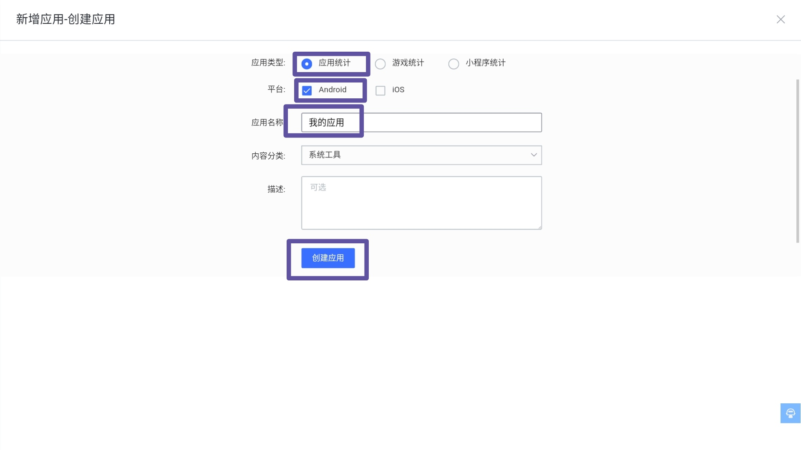
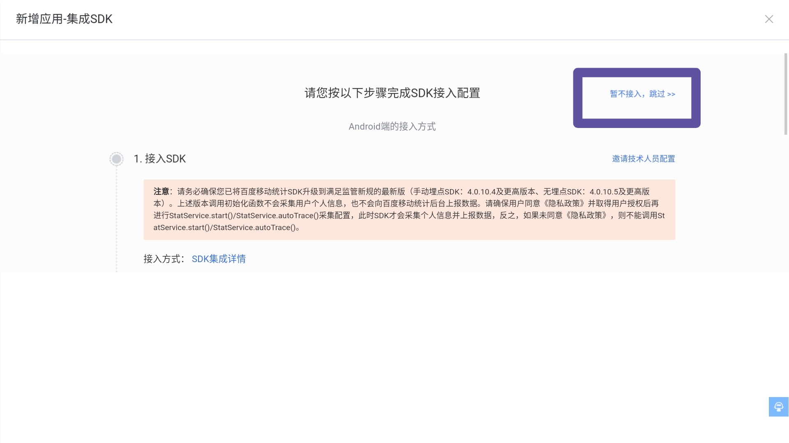
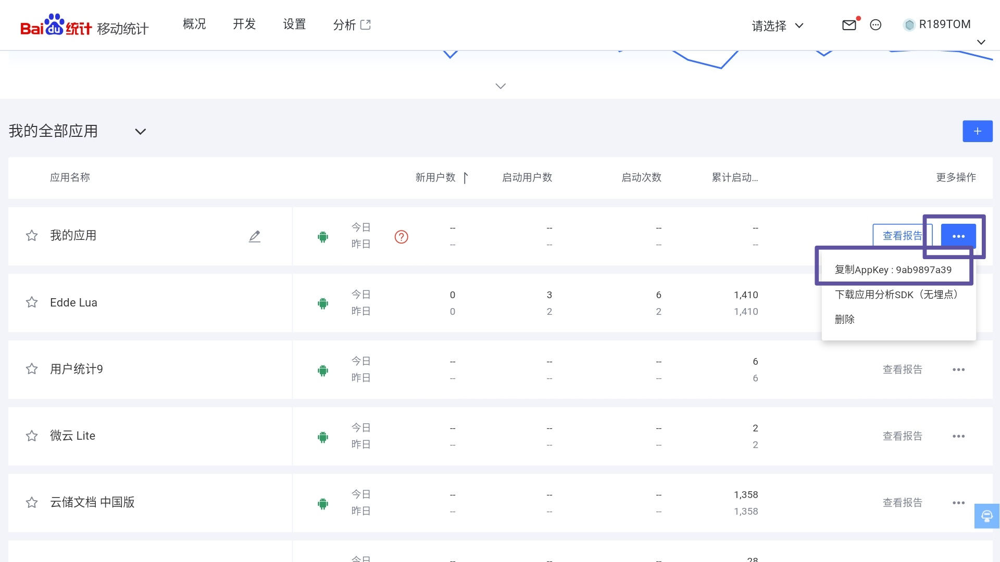
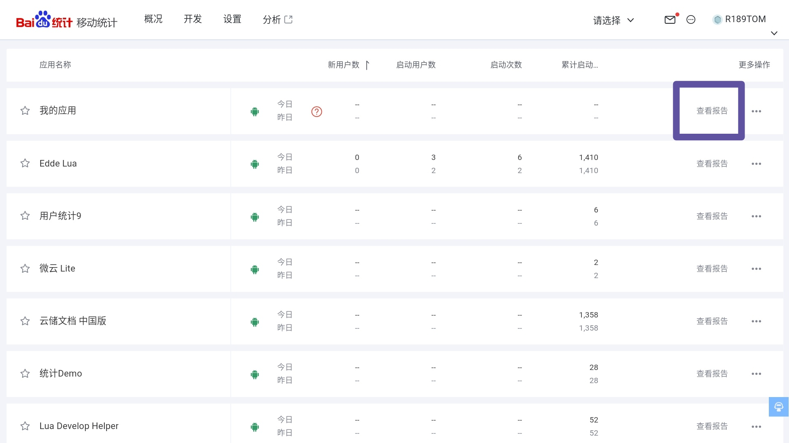
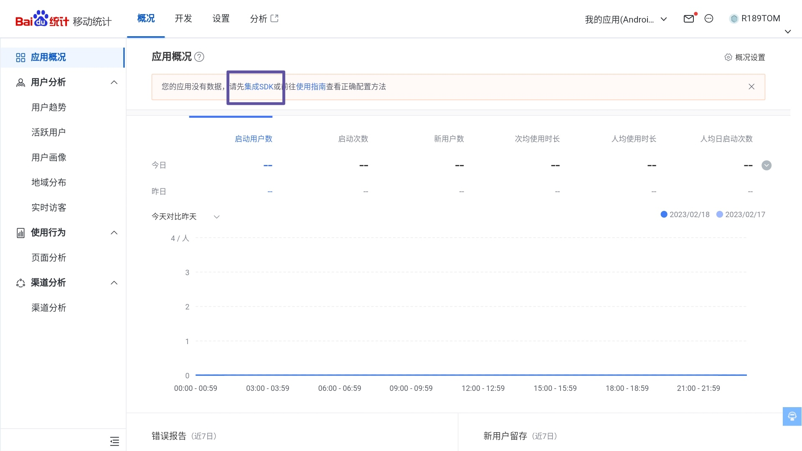
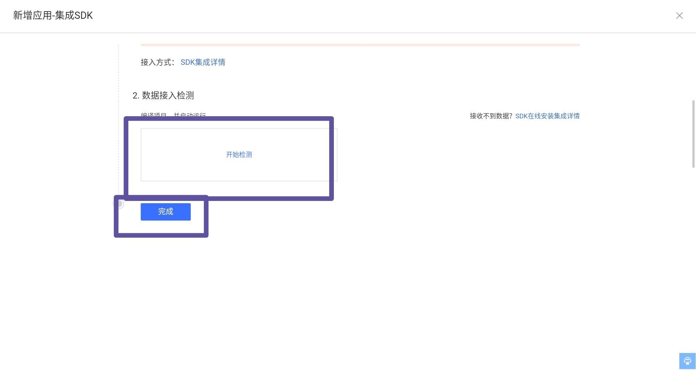

# 百度移动统计 SDK

> 此 SDK 为手动埋点版本，后期后期将不再维护

AndroLua+ 内置有百度移动统计，不建议使用此 Jar

[百度移动统计官网](https://mtj.baidu.com/)

> 手机端推荐打开「电脑模式后进入官网」

## 使用方法

1. 添加此 SDK
2. 在[我的全部应用](https://mtj.baidu.com/web/dashboard)内创建一个应用
    * __应用类型__：应用统计
    * __平台__：Android

    

3. 选择「暂不接入，跳过」，我们稍后再进行这一步

    

4. 在我的全部应用界面复制敢新建应用的 AppKey

    

5. 在项目的 `AndroidManifest.xml` 里面找到名称为`BaiduMobAd_STAT_ID`的 meta-data，将值改为刚才复制的 AppKey
6. 构建此项目，然后打包运行
7. 等待几分钟后，点击网站上的「查看报告」

    

8. 点击「应用概况」中的「集成SDK」

    

9. 检测应用是否成功接入

    

## 离线文档

[BaiduStat-Android-SDK API](doc/api/index-all.html)

## 升级注意事项

### 1、关于proguard

```
-keep class com.baidu.bottom.** { *; }
-keep class com.baidu.mobstat.** { *; }
```

具体参见文档。

### 2、关于Native Crash

如需使用Native Crash 功能，请集成libcrash_analysis.so库到APP中，开启Exception收集后，会默认统计Native + Java层Crash；

如无需使用，只引入Mtj JAR包即可，开启Exception收集后，会默认统计Java层Crash。

具体使用见文档。

### 3、关于manifest配置权限
具体参见文档。

## 相关链接

* [百度移动统计官网](https://mtj.baidu.com/)
* [我的全部应用](https://mtj.baidu.com/web/dashboard) - 百度移动统计
